

# UT1-A1 Documentación y sistema de control de versiones

***Nombre:*** Saúl Expósito (user1) y Efrén Pérez (user2).  
***Curso:*** 2º de Ciclo Superior de Desarrollo de Aplicaciones Web.

### ÍNDICE

+ [Introducción](#id1)
+ [Objetivos](#id2)
+ [Material empleado](#id3)
+ [Desarrollo](#id4)
+ [Conclusiones](#id5)

#### ***Introducción***. 

En esta práctica, hemos explorado, aunque sería más bien recordado, cómo usar Git y GitHub en un entorno colaborativo, imitando el flujo de trabajo que se da en equipos de desarrollo. Durante la práctica manejamos diversas herramientas como forks, branches o pull requests, así como tratar con la resolución de conflictos.

#### ***Objetivos***. 

Aprender a colaborar en proyectos de desarrollo utilizando Git y GitHub.

1.- Crear y saber utilizar ramas para que cada colaborador pueda trabajar de forma independiente sin afectar la rama principal.
2.- Crear y gestionar pull requests e issues.
3.- Resolver conflictos al fusionar ramas.
4.- Crear versiones del proyecto y gestionarlas con etiquetas.

#### ***Material empleado***. 

**1.- Hardware.**
- Empleamos ordenadores de sobremesa con acceso a Internet.

**2.- Software.**
- Sistema Operativo: Linux Mint.
- Terminal o consola Bash.
- Navegador web (Mozilla Firefox).
- Git en terminal y GitHub en navegador.

**3.- Configuraciones.**
- Configuración de usuario y correo de forma global con git (git config).
- Utilización de remotos (como "upstream").
- Gestionar permisos mediante claves SSH.

#### ***Desarrollo***. 

**1. Creación del repositorio inicial**

Saúl creó un repositorio público en su cuenta de GitHub con el nombre git-work, añadiendo un fichero README.md y una licencia MIT.
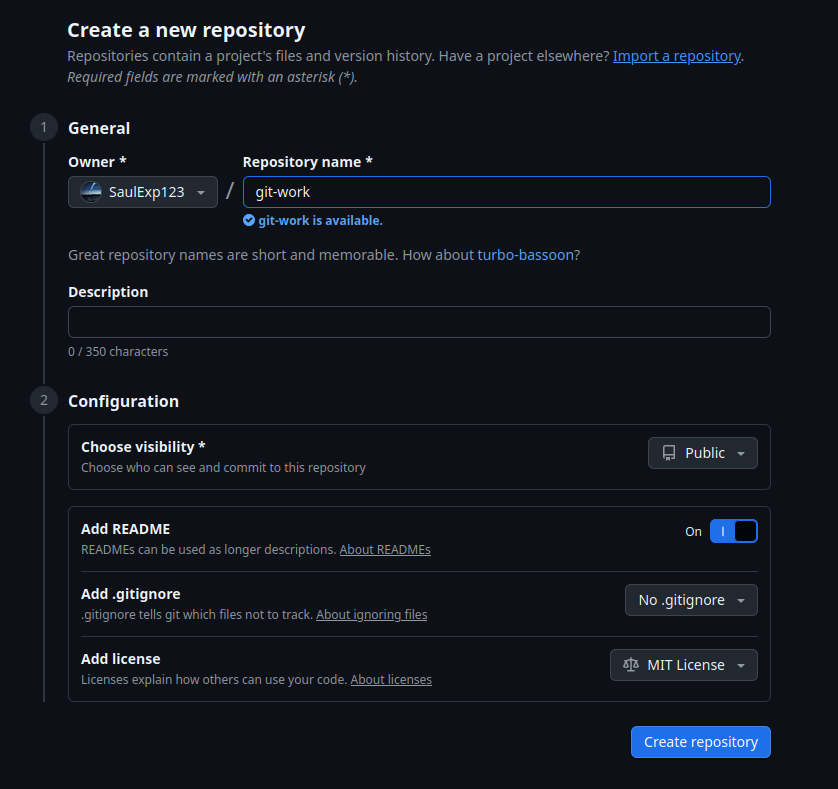

**2. Subida de archivos al repositorio**

Saúl clonó el repositorio y añadió los siguientes ficheros al proyecto:

- index.html
- bootstrap.min.css
- cover.css

Después, hizo el commit y los subió a origin/main.

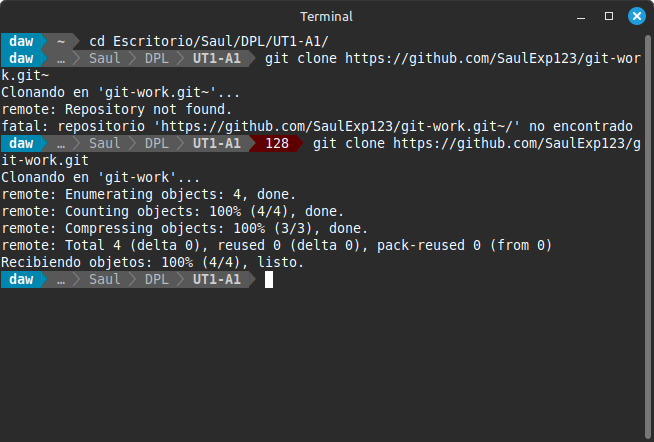
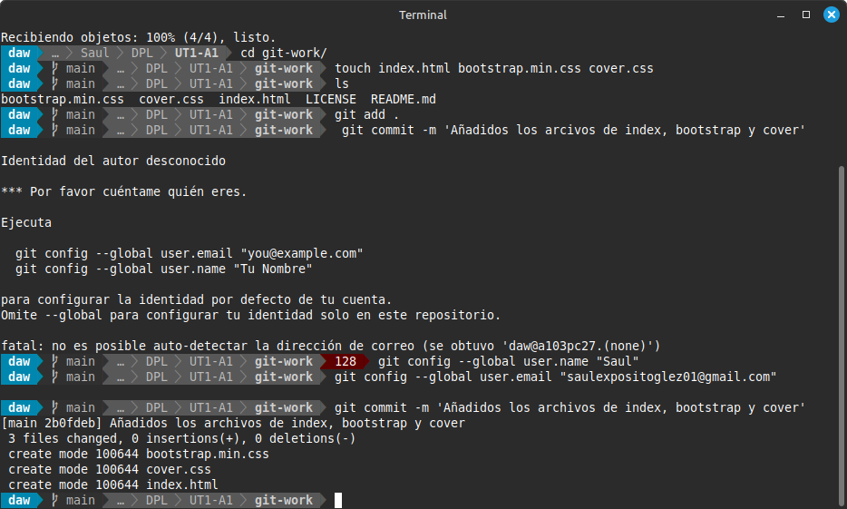

**3. Fork del repositorio por parte de Efrén**

Efrén realizó un fork del repositorio git-work en su cuenta personal.

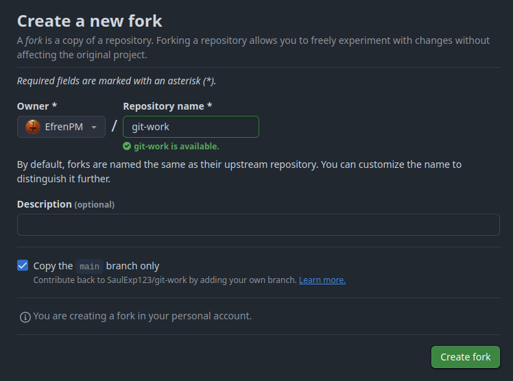

**4. Clonado del fork**

Efrén clonó su fork localmente para trabajar en él.

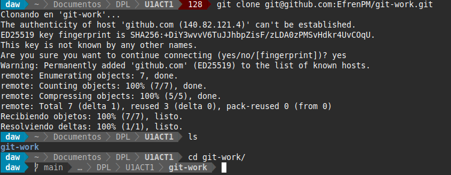

**5. Creación de issue por parte de user1**

Saúl creó la siguiente issue:

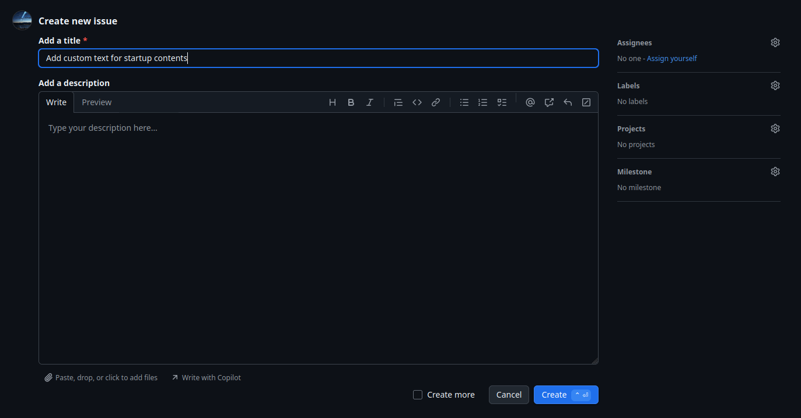

**6. Modificación por parte de Efrén**

Efrén creó una rama llamada custom-text, modificó el contenido de index.html para personalizarlo como si fuera una página de presentación para una startup, e hizo un commit con los cambios.

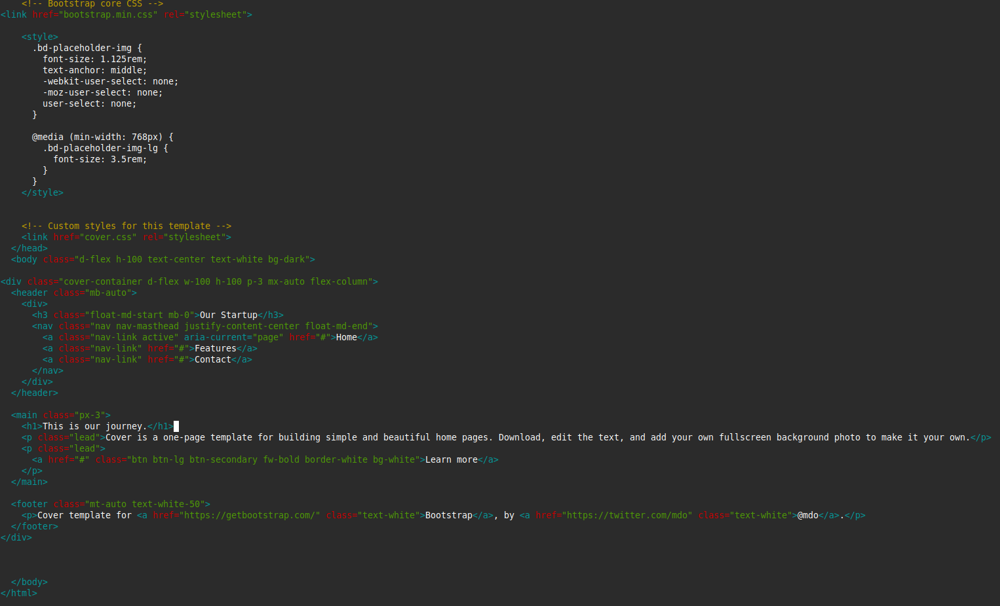

**7. Pull Request de Efrén a Saúl**

Efrén abrió un Pull Request desde su rama custom-text a la rama main del repositorio original de Saúl.

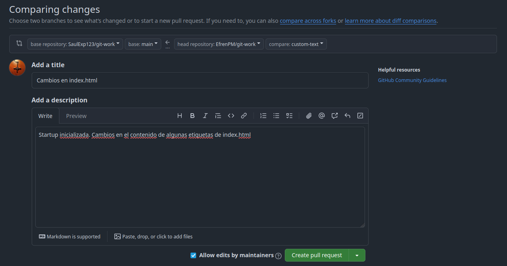

**8. Prueba del PR y modificaciones adicionales**

Saúl añadió el repositorio original como remoto upstream en su local, probó el PR en su máquina y realizó pequeños ajustes sobre el mismo PR, subiendo los cambios directamente a la rama de Efrén.

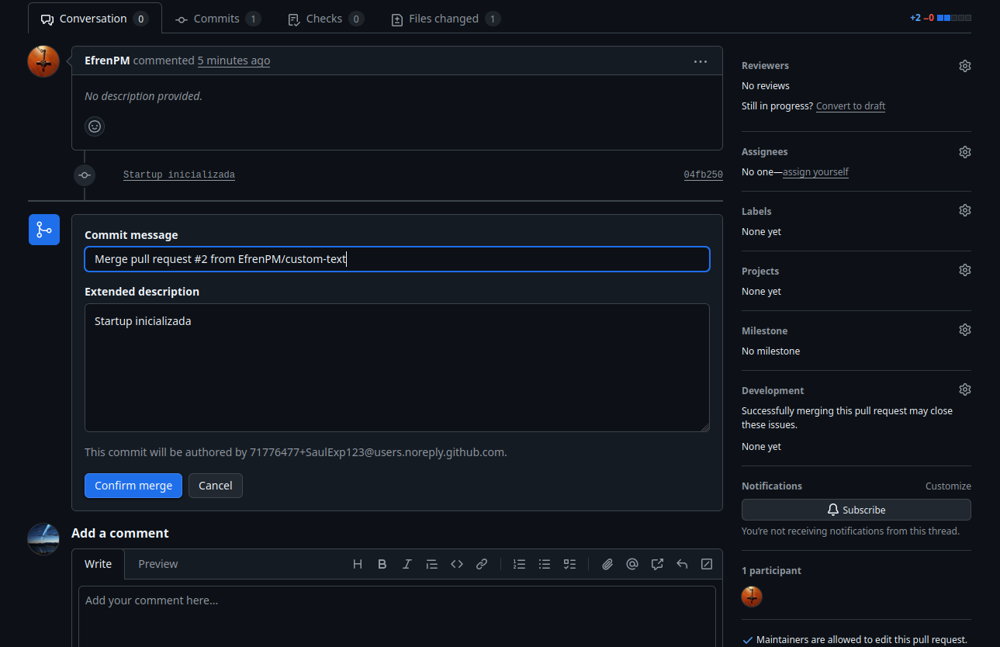
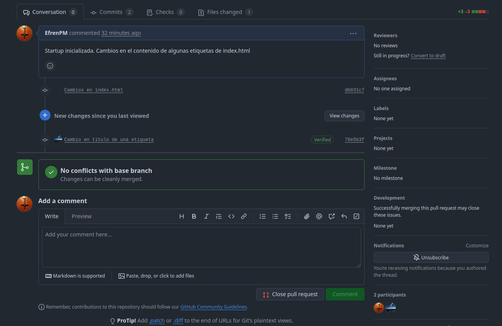

**9. Conversación colaborativa en el PR y aprobación**

Ambos usuarios intercambiaron comentarios dentro del PR y cada uno añadió un cambio adicional en el mismo. Finalmente, aprobó el PR, lo fusionó con la rama principal y cerró la issue original.

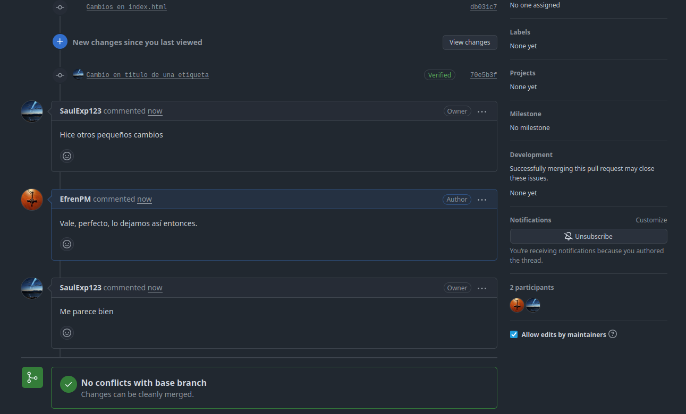

**10. Sincronización del fork**

Efrén actualizó su rama principal main con los cambios del repositorio original usando el remoto upstream, y de la misma, sincronizó su fork.

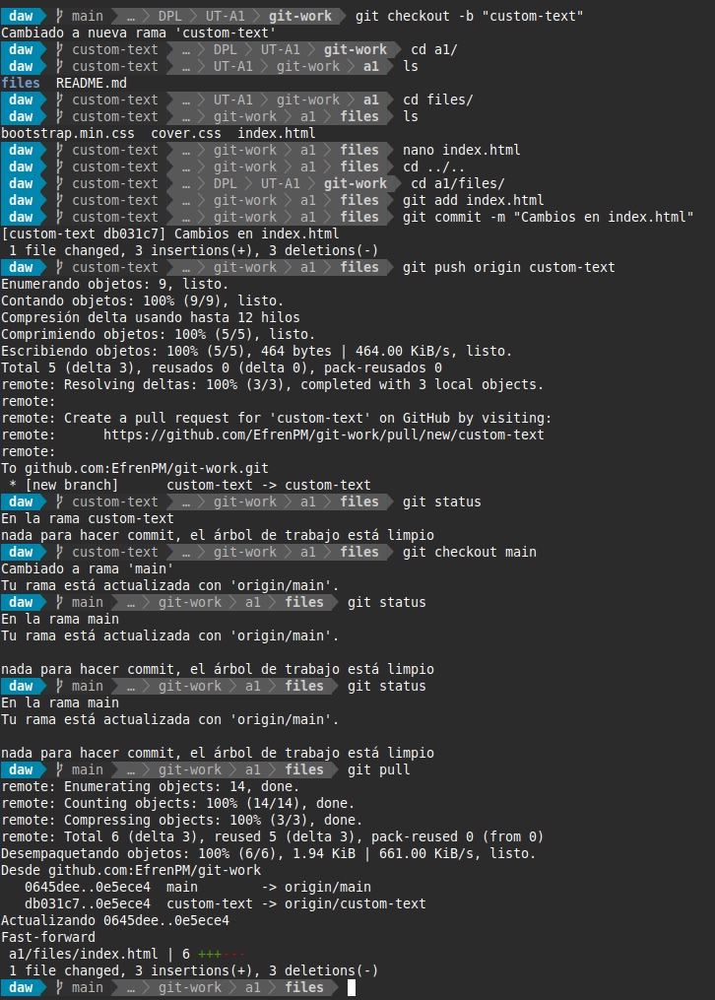

**12. Segunda issue: Mejora visual**

Saúl creó una nueva issue titulada "Improve UX with cool colors"

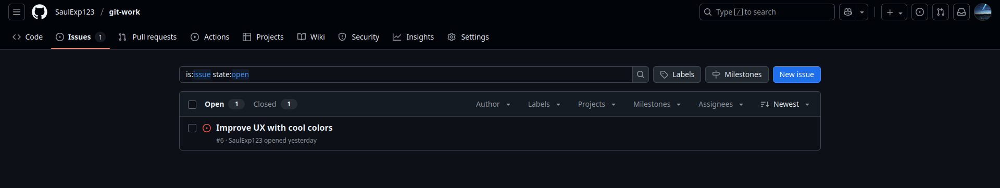

**13. Efrén cambió contenido de cover.css**

Efrén cambió algunas líneas en cover.css, creando previamente una rama nueva, cool-colors.

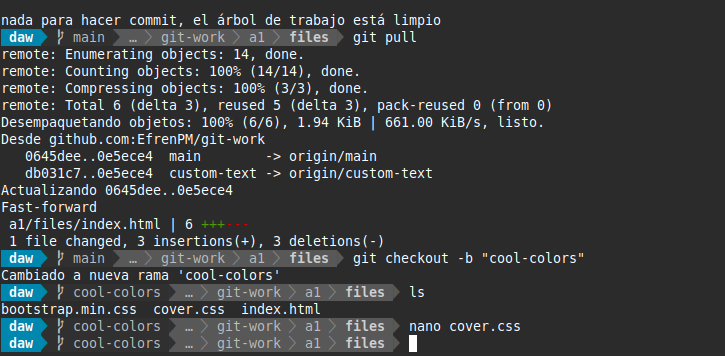
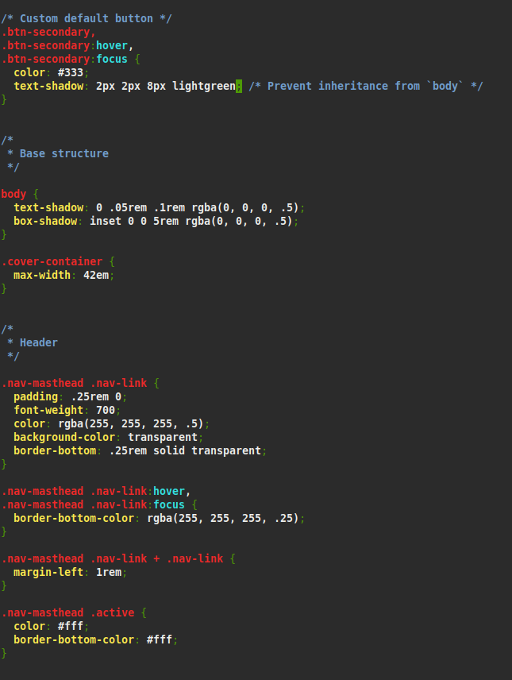

**14. Nueva Pull Request de Efrén a Saúl**

Efrén abrió un Pull Request desde su rama cool-colors a la rama main del repositorio original de Saúl.

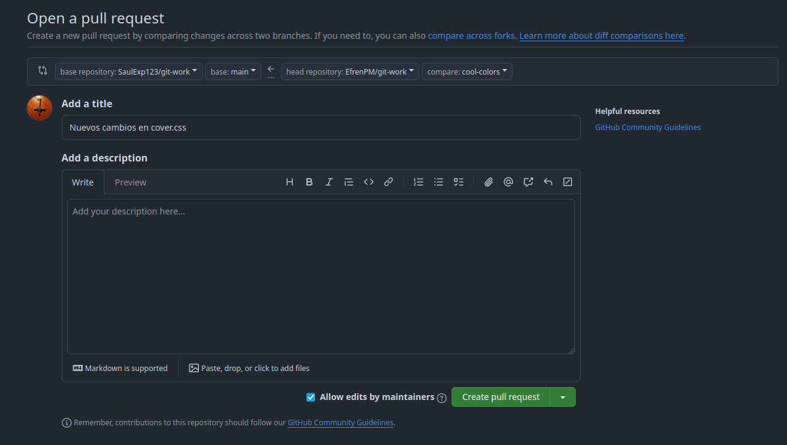

**15. Resolución de conflictos**

Saúl había previamente realizado modificaciones en cover.css sin haber realizado un git push, por ende, tras la PR de Efrén, tuvo que solventar los conflictos generados.

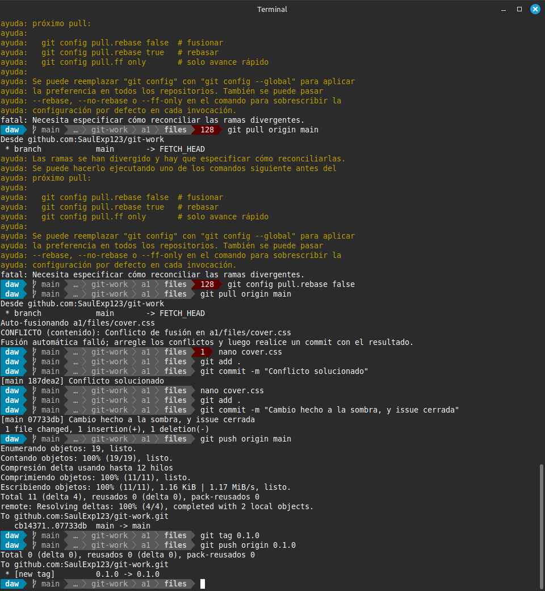

**16. Resoluciones y etiquetación final**

Tras resolver los conflictos, Saúl hizo un commit de sus cambios subiéndolos a su main. Finalmente etiquetó la versión del proyecto como la versión 0.1.0, creando una release apuntando hacia la etiqueta. Está etiquetación puede ser observable desde la pçagina principal del repositorio git-work de Saúl.

#### ***Conclusiones***. 

Esta práctica nos ha permitido aprender de forma práctica cómo colaborar en un entorno real de desarrollo con Git y GitHub. Hemos comprendido la importancia del uso de ramas para el trabajo individual, la utilidad de los pull requests para proponer cambios y la gestión de issues para organizar el trabajo. Aunque en definitiva, esta práctica nos ha acercado a las metodologías de trabajo reales en equipos de desarrollo, fomentando tanto la colaboración como la responsabilidad individual en el control de versiones.
